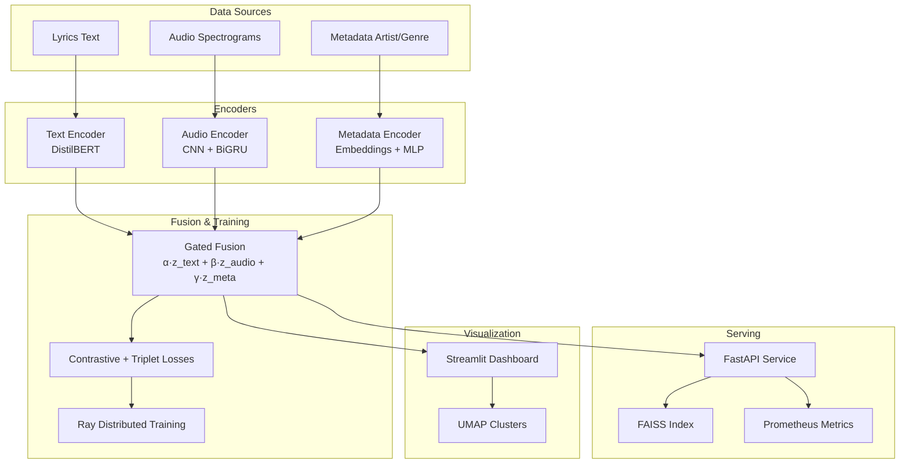

# Lyric2Vec:

A multimodal music embedding system for learning joint embeddings from song lyrics, audio spectrograms, and metadata (artist/genre) using contrastive learning and neural fusion.

## Goals & Success Metrics

- **Cross-modal retrieval**: Recall@10 ≥ 0.75 for text→audio and audio→text
- **Latency**: p99 < 120ms for search queries after warmup
- **Distributed training**: Ray speedup ≥ 3x on multi-GPU clusters
- **Production ready**: Prometheus metrics, Grafana dashboards, Kubernetes deployment

## Architecture



## Quickstart

### Prerequisites

- Python 3.11+
- Docker & Docker Compose
- Make

### 1. Setup Environment

```bash
cp .env.example .env
make setup
```

### 2. Data Pipeline

```bash
make data       # Download/prepare sample data
make prep       # Build processed dataset
```

### 3. Training

```bash
make train      # Ray distributed training
make export     # Export embeddings
make faiss      # Build FAISS index
```

### 4. Serve & Visualize

```bash
make up         # Start API + Prometheus + Grafana
make dash       # Launch Streamlit dashboard
```

## API Usage

### Health Check

```bash
curl "http://localhost:8080/healthz"
```

### Text Search

```bash
curl -X POST "http://localhost:8080/search" \
  -H "Content-Type: application/json" \
  -d '{
    "modal": "text",
    "query": "melancholic acoustic ballad with soft vocals",
    "k": 10
  }'
```

### Audio Search

```bash
curl -X POST "http://localhost:8080/search" \
  -H "Content-Type: application/json" \
  -d '{
    "modal": "audio",
    "audio_b64": "base64_encoded_audio_data",
    "k": 10
  }'
```

### Fused Search

```bash
curl -X POST "http://localhost:8080/search" \
  -H "Content-Type: application/json" \
  -d '{
    "modal": "fused",
    "query": "upbeat electronic dance music",
    "k": 20
  }'
```

## Dashboard Features

- **UMAP Clusters**: Visualize embedding space with interactive plots
- **Cross-modal Search**: Upload audio or enter text queries
- **Ablation Studies**: Compare text-only vs audio-only vs fused performance
- **Performance Metrics**: Real-time API latency and throughput

## Docker Services

- **API**: FastAPI service on port 8080
- **Prometheus**: Metrics collection on port 9090
- **Grafana**: Dashboards on port 3001
- **Weaviate**: Optional vector database (disabled by default)

## Kubernetes Deployment

```bash
kubectl apply -f infra/k8s/raycluster.yaml
kubectl apply -f infra/k8s/api-deployment.yaml
kubectl apply -f infra/k8s/api-service.yaml
```

## Monitoring

- **Prometheus**: `/metrics` endpoint with request latency, FAISS search time, encode time
- **Grafana**: Pre-configured dashboard with key performance indicators
- **Health Checks**: `/healthz` endpoint for liveness/readiness probes

## Make Targets

| Target     | Description                                             |
| ---------- | ------------------------------------------------------- |
| `setup`    | Install dependencies and setup environment              |
| `data`     | Download/prepare raw data                               |
| `prep`     | Build processed dataset                                 |
| `train`    | Run distributed training with Ray                       |
| `eval`     | Evaluate model performance                              |
| `export`   | Export embeddings to artifacts                          |
| `faiss`    | Build FAISS index                                       |
| `api`      | Start API server locally                                |
| `dash`     | Launch Streamlit dashboard                              |
| `up`       | Start all Docker services                               |
| `down`     | Stop all Docker services                                |
| `test`     | Run test suite                                          |
| `lint`     | Check code quality                                      |
| `pipeline` | Run full pipeline: data → prep → train → export → faiss |
| `clean`    | Clean processed data and artifacts                      |

## Project Structure

```
lyric2vec/
├── api/                    # FastAPI service
│   ├── app/               # Application code
│   └── tests/             # API tests
├── core/                  # Core library
│   ├── data/              # Data processing
│   ├── models/            # Neural network models
│   ├── train/             # Training scripts
│   ├── index/             # Embedding indexing
│   └── viz/               # Visualization
├── docker/                # Docker configuration
├── infra/                 # Infrastructure
│   ├── k8s/               # Kubernetes manifests
│   └── Makefile           # Build automation
├── notebooks/             # Jupyter notebooks
└── viz/                   # Streamlit dashboard
```

## Dataset Licensing

**Important**: This repository does not include copyrighted lyrics or audio files. Users must:

1. **Obtain proper licenses** for any lyrics/audio data used
2. **Store only embeddings** in the repository, not original content
3. **Respect copyright** and fair use guidelines
4. **Use public domain or licensed datasets** for training
